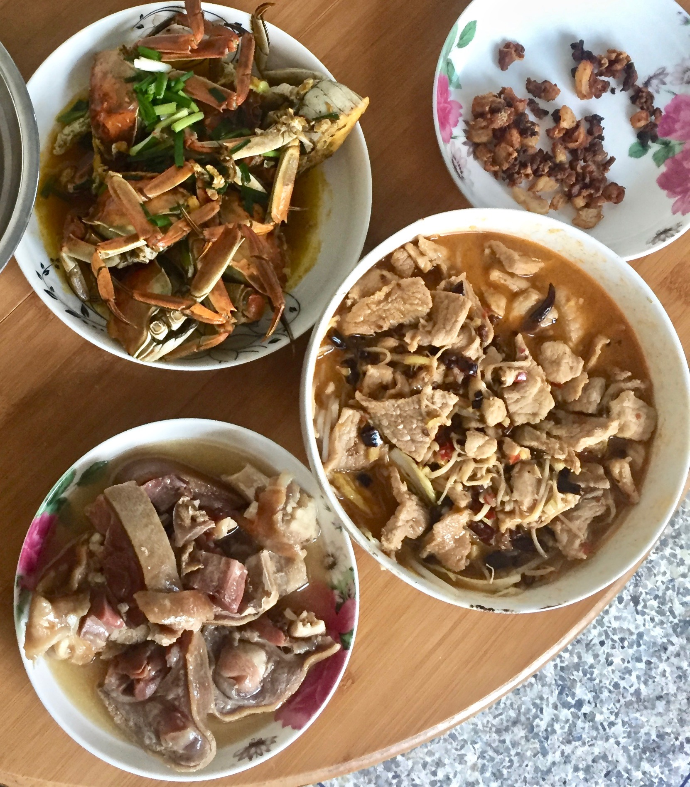

# 前记

外面点了一份水煮肉片，肉不够吃，遂自己准备煮一份。
只记过程，具体提调味靠自己品尝

# 准备材料

- 猪肉
- 白菜
- 豆芽
- 一个鸡蛋
- 金针菇
- 干辣椒
- 花椒
- 剁辣椒
- 豆瓣酱
- 胡椒粉
- 生抽
- 葱
- 姜
- 蒜
- 油

# 制作过程

1. 腌猪肉
  - 猪肉切薄片，过水洗去血水，沥干水分。
  - 加入盐、胡椒粉、生抽搅拌，拌匀后加入蛋清（一个鸡蛋），继续搅拌，最后加入植物油。
  - 腌制十分钟左右
2. 做底料
  - 姜蒜切末，白菜豆芽洗净，白菜切断，热油。
  - 先加入姜蒜剁辣椒，翻炒。
  - 后加入白菜豆芽，大火炒20秒左右断生，倒入盘中备用
3. 烫肉片
  - 锅中热油
  - 加入豆瓣酱，炒出红油
  - 加入水直至煮沸
  - 烫入金针菇，和肉片（肉片厚的话先烫肉片，此处可再加盐、味精调味）
  - 取出
4. 制作刀口辣椒
  - 干辣椒切碎
  - 热油，加入干辣椒碎和花椒翻炒出香味取出备用（辣椒和花椒不能炒焦了）
5. 装盘
   - 盘中依次加入蔬菜底料、烫好的肉片、铺上刀口辣椒，最后铺上姜蒜末
   - 热油至冒白烟
   - 将油泼在姜蒜末上即可

# 展示

1. 芋圆成品
  