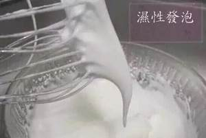
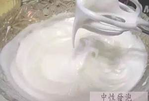
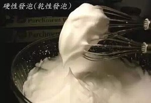
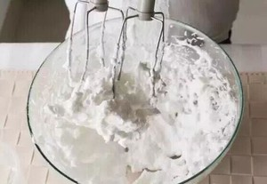

# 低筋、中筋、高筋粉的区别

- 低筋粉：
  - 低筋面粉是指水份13.8%,粗蛋白质9.5%以下的面粉。
  - 适合做蛋糕、饼干、小西饼点心、酥皮类点心等松散、酥脆、没有韧性的点心
- 中筋粉
  - 中筋粉是指水份13.8%,粗蛋白质8.5%以上的面粉
  - 适合做包子、馒头、饺子、烙饼等
- 高筋粉：
  - 高筋面粉是指水份14%,粗蛋白质11.5%以上的面粉
  - 适合做面包、面条等

# 湿性、中性、干性发泡的区别

蛋白搅拌的各个过程
1. 湿性发泡：
  

2. 中性发泡：
  

3. 干性发泡：
  
  
4. 蛋白打发过度
  

