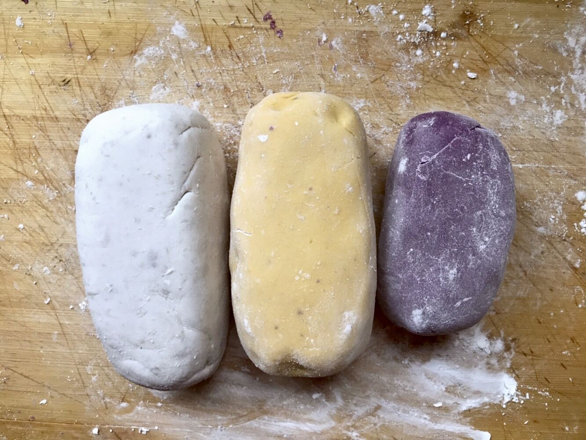
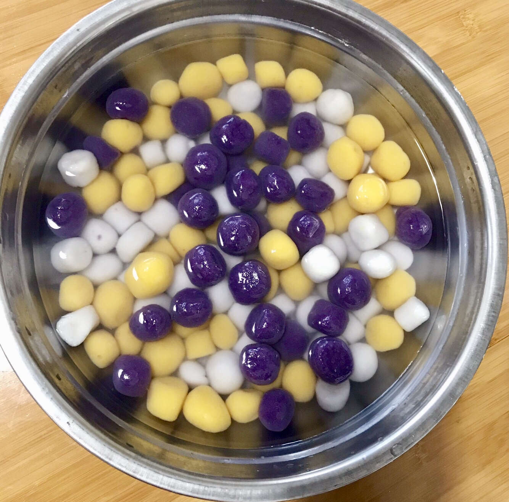
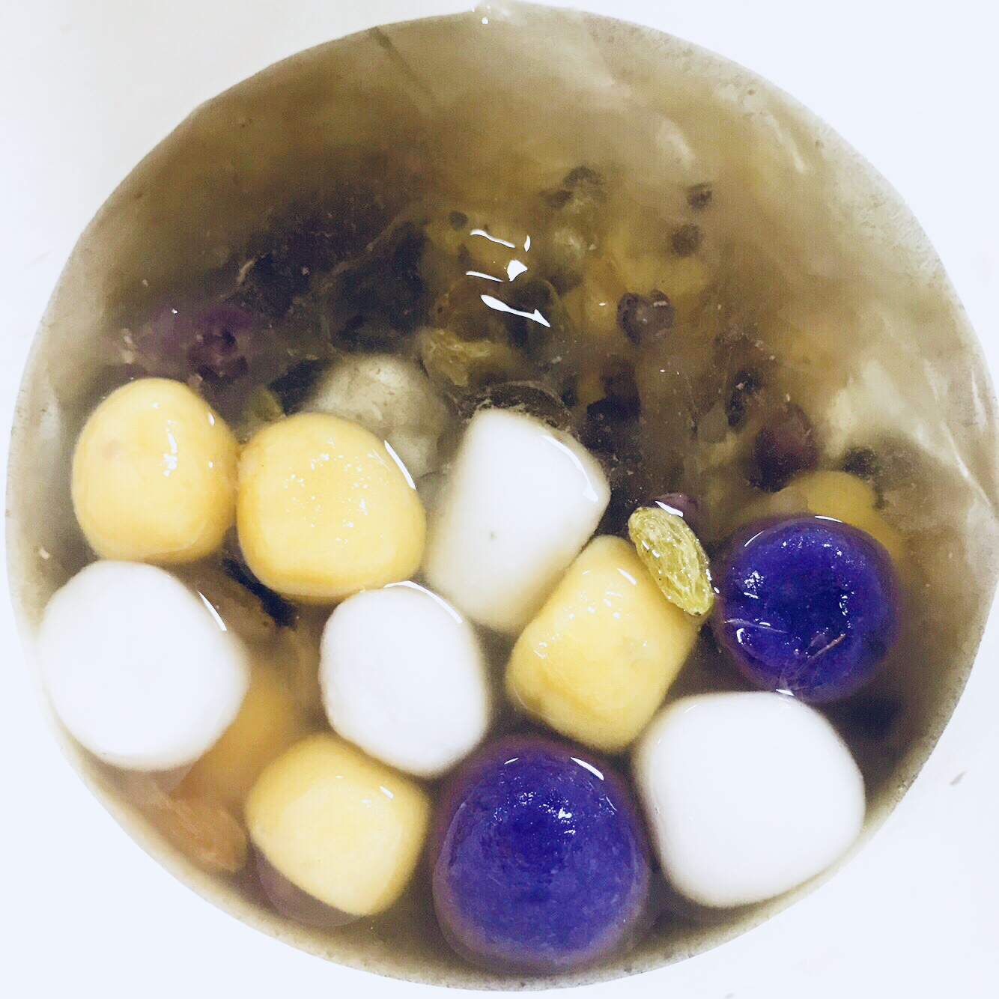

# 前记

很久没吃芋圆，想着中秋节吃芋圆团团圆圆，遂买了材料准备做芋圆。

# 准备材料
  - 红薯
  - 紫薯
  - 芋头
  - 木薯粉
  - 冰粉粉
  - 糖豆
  - 西米
  - 葡萄干

# 制作过程

1. 做冰粉：
  - 冰粉粉加90度热水，静置冷却凝固
2. 做芋圆：
  - 将红薯、紫薯、芋圆洗净煮熟（煮的较为软烂）
  - 分别将红薯、紫薯、芋圆取出剥皮，分别加入木薯粉揉团，揉至不粘手
  - 都揉好后，依次切成小个，放入锅中煮熟，煮到飘起来就差不多了，
  - 捞起放在冰水中（放入冰水中口感会更好）
3. 煮西米
  - 西米泡水（5-10分钟）
  - 煮西米，直至西米中心只有小小的白点，关火闷一下就可以取出过冷水
4. 合成芋圆甜品
  - 依次加入冰粉、糖豆、芋圆、西米、葡萄干。即完成（之前没有加糖豆，感觉味道和市面上的差了很多，具体的小配料，自己想吃什么加什么）

# 展示

1. 芋圆揉团
  

2. 芋圆过冷水
  
  
3. 芋圆成品
  